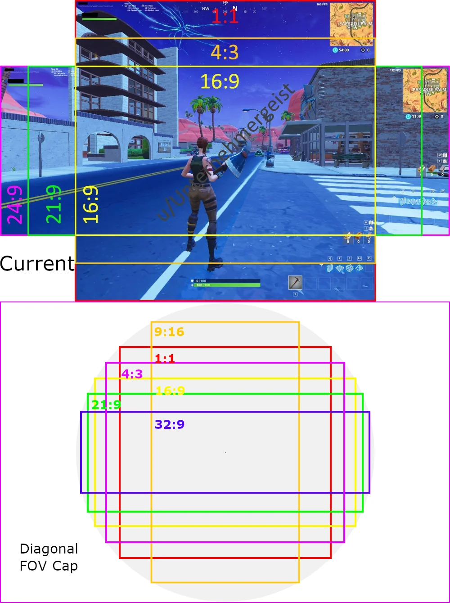
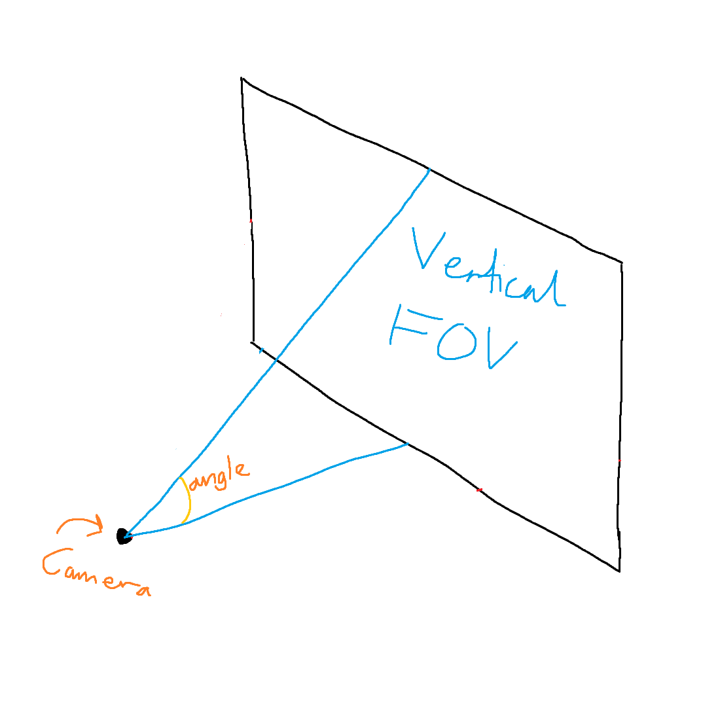
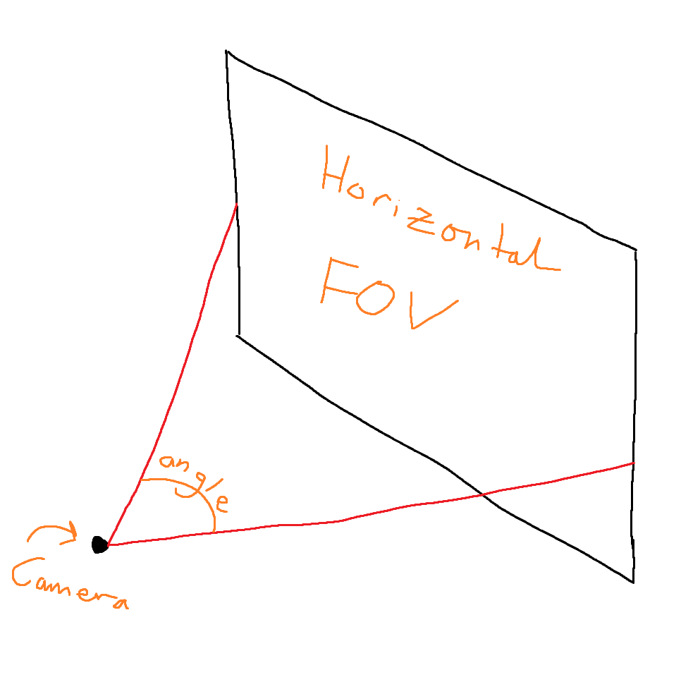
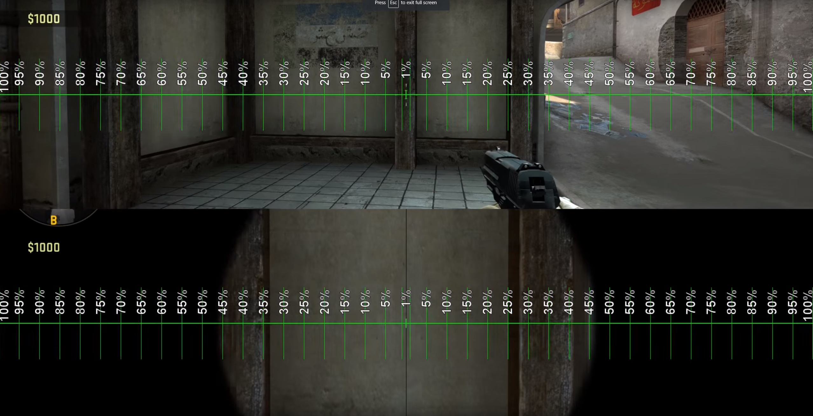
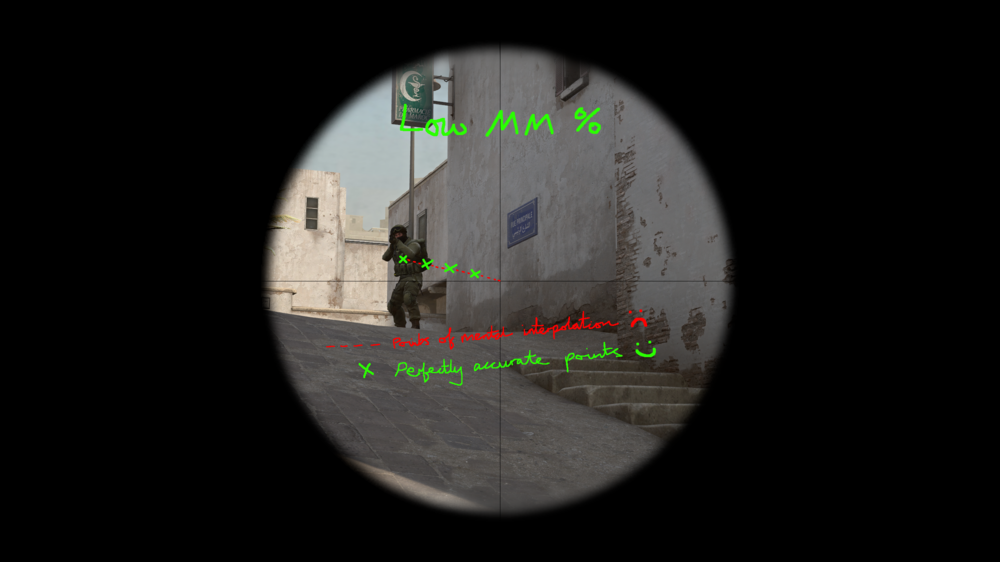
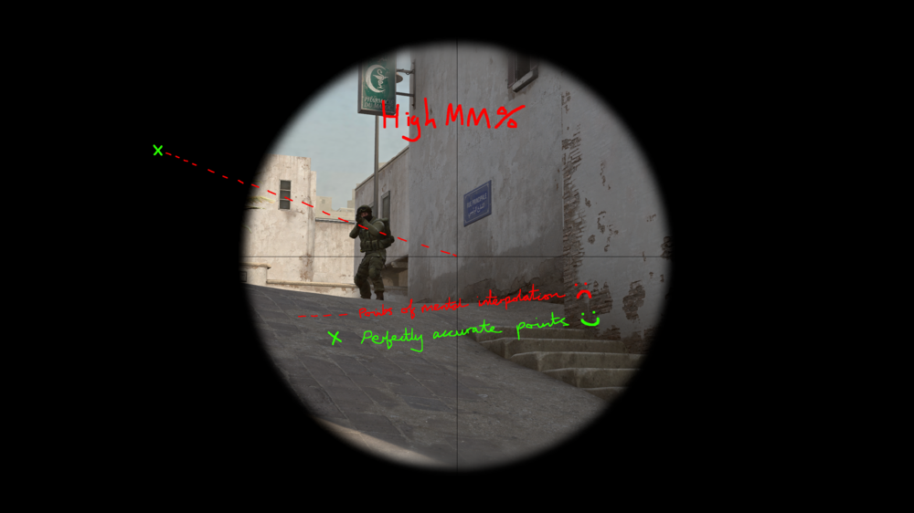

# Aim Pro: Monitor Distance Sensitivity

	&bull; <a href="#en">EN</a> &bull; <a href="#ru">RU</a> 

## EN

### Mod description

Calculates the sensitivity for **`sniperMode`** from the multiplier (slider in settings) of **`arcadeMode`**. The **`sniperMode`** multiplier is ignored.
The multiplier(slider in settings) **`arcadeMode`** adjusts the sensitivity for both **`arcadeMode`** and **`sniperMode`**, creating scalability of sensitivity on the monitor when changing **`FOV`**(Arcade, Zoom x2, etc).

### How it works

**`Aspect Ratio`** is the ratio between the width and height of the screen  

**`Monitor Distance Vertical`** = **`[MDV]`** - does not depend on aspect ratio

**`Monitor Distance Horizontal`** = **`[MDH]`** - directly dependent on aspect ratio

There are 7 methods to choose from:

- **`Focal Length`** ( Recommended for everyone ) - **`MDV(H) 0%`** - means that the speed of tracking a moving target will be the same
- **`Jedi's Trick`** - this method is using the average 360 distance between **`MDV 0%`** and **`MDV 100%`** for the conversion
- **`MDV 100%`** - this is exactly the same as the **`MDH`**, but is instead using the vertical **`FOV`**
- **`MDV 133%`** - this is exactly the same as the **`MDH`**, but is instead using the vertical **`FOV`**
- **`MDH 60%`** - means moving the crosshair to aim at `60%` of the distance between the crosshair and the edge of the monitor is the same
- **`MDH 75%`** - means moving the crosshair to aim at `75%` of the distance between the crosshair and the edge of the monitor is the same
- **`MDH 100%`** - will match the movement to aim at something at the edge of the monitor

LowMM

HighMM

Example from popular games:, with multiplier `1`:

- CS2(CS:GO) - **`MDV 133%`**
- RUST - **`MDV 100%`**
- VALORANT - **`MDH 100%`**
- Apex Legends - **`Focal Length`**

Example of sensitivity calculation with mod in WoT:

**`arcadeMode`** sensitivity = 1; **`sniperMode`** = Zoom: x2, x4, x8;

Zoom = **`sniperMode`** sensitivity

> ***note**: the sensitivity values x2, x4, x8 are not for **`preferences.xml`** but for demonstration*

**`Focal Length`**
- x2 = 0.47180057
- x4 = 0.232665
- x8 = 0.11593625

**`Jedi's Trick`**
- x2 = 0.485491
- x4 = 0.241021
- x8 = 0.1202975

**`MDV 100%`**
- x2 = 0.5
- x4 = 0.25
- x8 = 0.125

**`MDV 133%`**
- x2 = 0.518795
- x4 = 0.2620565
- x8 = 0.131372

**`MDH 60%`**
- x2 = 0.503505
- x4 = 0.252216
- x8 = 0.126108

**`MDH 75%`**
- x2 = 0.518795
- x4 = 0.2620565
- x8 = 0.131372
	
**`MDH 100%`**
- x2 = 0.547274
- x4 = 0.281204
- x8 = 0.14161825

### How to use

- Adjust the **`arcadeMode`** sensitivity using the slider in the game settings  
**or**  
- Adjust sensitivity by multiplier in the **`preferences.xml`** file at the path:
  - Go to **`%APPDATA%\Wargaming.net\WorldOfTanks`** or **`%APPDATA%\Lesta\MirTankov`**
  - Edit **`preferences.xml`**
  - Change **`<sensitivity>`** in **`<arcadeMode>`**
  - Save your changes

### Features

- Does not require updating for the game version
- Works without API

### Compatibility

- This mod should be compatible with almost everything

### Contributions

Thanks to:

- [Pruszko](https://github.com/Pruszko) - for the implementation of the code

### For nerds

- [Conversion method guide. (and other FAQ's)](https://www.mouse-sensitivity.com/forums/topic/4704-conversion-method-guide-and-other-faqs/)
- [Error Mathematics](https://www.mouse-sensitivity.com/forums/topic/8190-error-mathematics/)
- [Mouse Sensitivity - Monitor Distance Guide](https://youtu.be/RYCrGAJshvQ)
- [Mouse Sensitivity](https://www.mouse-sensitivity.com/)
- [Useful guidelines - WoT](https://sheet.zohopublic.eu/sheet/published/fzegf41a48bbb4bf2473dbbeb4d24452d3df6)

### Contact

[WoT Official Discord](https://discord.gg/world-of-tanks)

> ***note**: please do not disturb **Pruszko** unnecessarily*

**Pruszko** as @**Pruszko** **[EU]** in **[EN]** | **[PL]**

**shuxue** as @**shuxue** **[EU]** in **[EN]** | **[RU]**

### Installation

1. Download **`unzip.AimPro.zip`**
2. Unzip
3. Choose 1 of 7 methods
4. Copy the selected **`AimPro-method`** file into **`[WoT or MT game directory]/mods/[version]/`** directory

## RU

### Описание мода

Вычисляет чувствительность для **`sniperMode`** из множителя(ползунок в настройках) **`arcadeMode`**. Множитель **`sniperMode`** игнорируется.
Множитель(ползунок в настройках) **`arcadeMode`** регулирует чувствительность для **`arcadeMode`** и **`sniperMode`**, создавая масштабируемость чувствительности на мониторе при изменении **`FOV`**(Arcade, Zoom x2 и т.д.).

### Как это работает

**`Aspect Ratio`** - это соотношение между шириной и высотой экрана

**`Monitor Distance Vertical`** = **`[MDV]`** - не зависит от соотношения сторон

**`Monitor Distance Horizontal`** = **`[MDH]`** - напрямую зависит от соотношения сторон  

На выбор предлагается 7 методов:

- **`Focal Length`** ( Рекомендуется для всех ) - **`MDV(H) 0%`** - означает, что скорость отслеживания движущейся цели будет одинаковой
- **`Jedi's Trick`** - этот метод использует среднее расстояние 360 между **`MDV 0%`** и **`MDV 100%`** для конвертации
- **`MDV 100%`** - это то же самое, что и **`MDH`**, но вместо этого используется вертикальный **`FOV`**
- **`MDV 133%`** - это то же самое, что и **`MDH`**, но вместо этого используется вертикальный **`FOV`**
- **`MDH 60%`** - означает перемещение перекрестия для прицеливания на `60%` от расстояния между перекрестием и краем монитора
- **`MDH 75%`** - означает перемещение перекрестия для прицеливания на `75%` от расстояния между перекрестием и краем монитора
- **`MDH 100%`** - будет соответствовать перемещению, чтобы нацелиться на что-то у края монитора

LowMM

HighMM

Пример из популярных игр:, с множителем `1`:

- CS2(CS:GO) - **`MDV 133%`**
- RUST - **`MDV 100%`**
- VALORANT - **`MDH 100%`**
- Apex Legends - **`Focal Length`**

Пример расчета чувствительности с помощью мода в WoT и MT:

**`arcadeMode`** чувствительность = 1; **`sniperMode`** = Зум: x2, x4, x8;
Зум = **`sniperMode`** чувствительность

> ***примечание**: значения чувствительности x2, x4, x8 не для **`preferences.xml`**, а для демонстрации*

**`Focal Length`**
- x2 = 0.47180057
- x4 = 0.232665
- x8 = 0.11593625

**`Jedi's Trick`**
- x2 = 0.485491
- x4 = 0.241021
- x8 = 0.1202975

**`MDV 100%`**
- x2 = 0.5
- x4 = 0.25
- x8 = 0.125

**`MDV 133%`**
- x2 = 0.518795
- x4 = 0.2620565
- x8 = 0.131372

**`MDH 60%`**
- x2 = 0.503505
- x4 = 0.252216
- x8 = 0.126108

**`MDH 75%`**
- x2 = 0.518795
- x4 = 0.2620565
- x8 = 0.131372
	
**`MDH 100%`**
- x2 = 0.547274
- x4 = 0.281204
- x8 = 0.14161825

### Как использовать

- Настройте чувствительность режима **`arcadeMode`** с помощью ползунка в настройках игры  
**или**  
- Настройте чувствительность с помощью множителя в файле **`preferences.xml`** по пути:
  - Перейдите в **`%APPDATA%\Wargaming.net\WorldOfTanks`** или **`%APPDATA%\Lesta\MirTankov`**
  - Отредактируйте **`preferences.xml`**
  - Измените **`<sensitivity>`** в **`<arcadeMode>`**
  - Сохраните изменения

### Особенности

- Не требует обновления версии игры
- Работает без API

### Совместимость

- Этот мод должен быть совместим практически со всем

### Вклады

Благодарю:

- [Pruszko](https://github.com/Pruszko) - за реализацию кода

### Для ботаников

- [Conversion method guide. (and other FAQ's)](https://www.mouse-sensitivity.com/forums/topic/4704-conversion-method-guide-and-other-faqs/)
- [Error Mathematics](https://www.mouse-sensitivity.com/forums/topic/8190-error-mathematics/)
- [Mouse Sensitivity - Monitor Distance Guide](https://youtu.be/RYCrGAJshvQ)
- [Mouse Sensitivity](https://www.mouse-sensitivity.com/)
- [Useful guidelines - WoT](https://sheet.zohopublic.eu/sheet/published/fzegf41a48bbb4bf2473dbbeb4d24452d3df6)

### Контакты

[WoT Official Discord](https://discord.gg/world-of-tanks)

> ***примечание**: просьба не беспокоить **Pruszko** без необходимости*

**Pruszko** как @**Pruszko** **[EU]** в **[EN]** | **[PL]**

**shuxue** как @**shuxue** **[EU]** в **[EN]** | **[RU]**

### Установка

1. Скачайте **`unzip.AimPro.zip`**
2. Разархивируйте
3. Выберите 1 из 7 методов
4. Скопируйте выбранный файл **`AimPro-метод`** в директорию **`[директория игры WoT или MT]/mods/[версия]/`**
